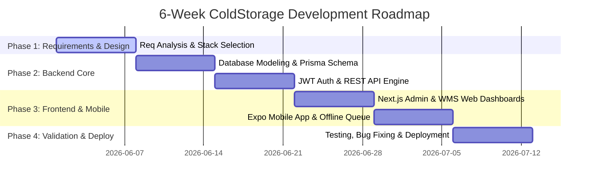
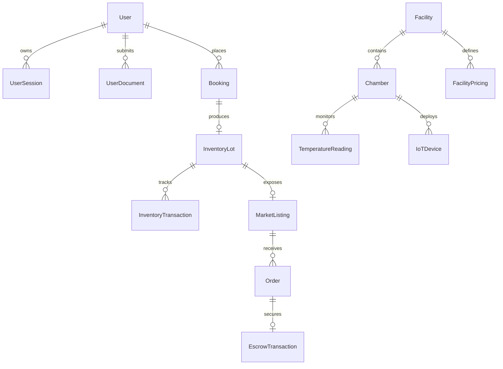

# CHAPTER 4: INTERNSHIP WORK PERFORMED (WEEK-WISE)

---

## 4.1 Week 1 – Requirement Analysis & Project Planning

The primary objective of Week 1 was to conduct comprehensive domain research, analyze operational bottlenecks in existing cold storage infrastructure, define functional and non-functional system requirements, establish architectural paradigms, and formulate a 6-week development roadmap.

### 4.1.1 Stakeholder Analysis & User Requirements

Through literature review and analysis of cold storage operations in major agricultural belts (e.g., Uttar Pradesh), four primary system roles were identified:

```
┌─────────────────────────────────────────────────────────────────────────┐
│                      STAKEHOLDER ROLE TAXONOMY                          │
├───────────────┬─────────────────┬──────────────────┬────────────────────┤
│ Platform Admin│  Facility Owner │ Operational Staff│   Primary Producer │
│  & Regulator  │    & Manager    │  (Weigh/Assay)   │   (Farmer) & Buyer │
└───────┬───────┴────────┬────────┴────────┬─────────┴─────────┬──────────┘
        │                │                 │                   │
        ▼                ▼                 ▼                   ▼
  Compliance &     Chamber & Space   Intake, Weighing,   Discovery, Remote
  Governance       Optimization      Lots & Dispatches   OTP & Marketplace
```

1. **Platform Administrator:** Requires macro-level oversight across nationwide facilities, compliance tracking (FSSAI, WDRA, Fire Safety licenses), anti-gouging pricing oversight, and global dispute resolution logs.
2. **Cold Storage Owner & Manager:** Requires chamber-wise volumetric tracking, automated rent calculation, labor payroll tracking, temperature profile monitoring, and financial revenue reports.
3. **Warehouse Operational Staff:** Requires digitized weighbridge entry, quality grading (`A`/`B`/`C`), lot creation, printable QR barcode generation, and dispatch gate pass verification.
4. **Farmer (Depositor) & Institutional Buyer:** Farmers require location-based facility discovery, remote OTP dispatch authorization (eliminating the "Travel Tax"), live lot health tracking, and Mandi price intelligence. Buyers require pan-India verified inventory search, quality assurance logs, and zero-trust escrow settlement.

### 4.1.2 Technology Stack Selection & Architecture Definition

During Week 1, competitive stack evaluations were conducted to select high-throughput, type-safe, and modular technologies:

| Domain | Selected Technology | Alternative Evaluated | Selection Rationale |
|---|---|---|---|
| **Backend Framework** | Node.js 22 + Express 5 | NestJS / FastAPI | High asynchronous I/O performance, lightweight execution, fast route registration. |
| **Database ORM** | Prisma 7 + PostgreSQL 16 | TypeORM / Sequelize | Declarative schema design, native ACID compliance, auto-generated TypeScript client. |
| **Caching Tier** | Redis 7 | Memcached | Native data structures for rate-limiting counters, token blacklist, and idempotency keys. |
| **Web Dashboard** | Next.js 16 (App Router) + React 19 | Vite SPA | Server-Side Rendering (SSR), automatic route optimization, rich component ecosystem. |
| **Mobile Client** | Expo 56 + React Native | Flutter / Native Android | Single TypeScript codebase for iOS/Android, native device access (Camera, Haptics, Storage). |
| **Type Generator** | Node.js Script (`generate-types.mjs`) | Manual Typing | Automatically syncs Prisma scalar types into framework-independent interfaces in `shared/`. |

### 4.1.3 Project Plan & Milestone Breakdown

A 6-week phased milestone plan was established to guide system design, API creation, web dashboard development, mobile app construction, testing, and production deployment:



---

## 4.2 Week 2 – Database Design & Backend Development

Week 2 focused on architecting the relational database schema, enforcing domain normalization, writing Prisma migrations, populating seed data, and configuring backend server infrastructure.

### 4.2.1 Database Schema Modeling (23 Prisma Models & 18 Enums)

The relational schema (`backend/prisma/schema.prisma`) was designed to represent the complete lifecycle of cold storage operations, financial billing, commodity trading, and user verification.



#### Core Data Entities Detailed:
- **`User` (6 Roles):** Stores user identity (`SUPER_ADMIN`, `ADMIN`, `OWNER`, `STAFF`, `FARMER`, `BUYER`), contact details, phone verification status, and role-specific KYC attributes (Aadhaar, PAN, GSTIN, Khasra land numbers, FSSAI numbers).
- **`Facility` & `Chamber`:** Models physical storage complexes, volumetric capacities (MT), temperature operational ranges (-25°C to +15°C), and storage types (`BAG`, `BULK`, `HYBRID`).
- **`Booking`:** Tracks the storage lifecycle through 11 explicit states (`PENDING` $\rightarrow$ `CONFIRMED` $\rightarrow$ `ARRIVED` $\rightarrow$ `WEIGHING` $\rightarrow$ `STORED` $\rightarrow$ `DISPATCH_REQUESTED` $\rightarrow$ `DISPATCHING` $\rightarrow$ `DISPATCHED` $\rightarrow$ `COMPLETED`).
- **`InventoryLot` & `InventoryTransaction`:** Represents stored commodities (weight in KG, bag count, moisture level, grade `A`/`B`/`C`) alongside immutable audit logs of all intakes, partial dispatches, quality updates, and transfers.
- **`MarketListing`, `Order`, & `EscrowTransaction`:** Facilitates direct buyer procurement with nodal account escrow holding payments until gate pass scanning.

### 4.2.2 Migrations, Seeds, and Redis Integration

- **Prisma Migrations:** Executed `npx prisma migrate dev` to generate structured SQL migrations supporting relational foreign keys and cascade rules.
- **Database Seeding (`seed.ts`):** Developed a comprehensive seed script populating demo facilities, chambers, sample farmers, buyers, lots, and temperature records.
- **Redis Connection Layer (`redis.ts`):** Configured Redis 7 for high-speed session token tracking and rate limiting, including a graceful degradation wrapper that falls back to in-memory maps if Redis is offline.

---

## 4.3 Week 3 – Authentication & API Development

Week 3 centered on building the REST API server using **Express 5**, implementing secure authentication mechanisms, setting up validation middleware, writing modular feature controllers, and mounting OpenAPI/Swagger documentation.

```
┌─────────────────────────────────────────────────────────────────────────┐
│                     EXPRESS 5 API ROUTING PIPELINE                      │
├─────────────────────────────────────────────────────────────────────────┤
│ [HTTP Request]                                                          │
│        │                                                                │
│        ▼                                                                │
│  [Helmet Security & CORS Middleware]                                   │
│        │                                                                │
│        ▼                                                                │
│  [Redis Rate Limiter Middleware]                                        │
│        │                                                                │
│        ▼                                                                │
│  [JWT Authentication Guard (auth.middleware.ts)]                        │
│        │                                                                │
│        ▼                                                                │
│  [Role Authorization Guard (requireRole)]                               │
│        │                                                                │
│        ▼                                                                │
│  [Zod Request Validation Middleware (validate.ts)]                      │
│        │                                                                │
│        ▼                                                                │
│  [Idempotency Middleware (idempotency.ts)]                              │
│        │                                                                │
│        ▼                                                                │
│  [Feature Controller Execution] ──► [Prisma ORM] ──► [PostgreSQL]      │
│        │                                                                │
│        ▼                                                                │
│  [Standard API Response Envelope ({ success: true, data: ... })]        │
└─────────────────────────────────────────────────────────────────────────┘
```

### 4.3.1 Key API Engineering Accomplishments

1. **Dual-Token JWT Security:** Implemented 15-minute Access Tokens and 7-day Refresh Tokens stored securely, supported by full token revocation in `UserSession`.
2. **Phone OTP Verification Engine:** Integrated **MSG91** SMS gateway for passwordless mobile login, phone verification, and sensitive dispatch OTP generation.
3. **Idempotency Guard (`idempotency.ts`):** Developed header-based idempotency tracking (`X-Idempotency-Key`) in Redis to intercept and reject duplicate financial or booking transactions within 24 hours.
4. **API Module Coverage (23 Feature Modules):** Constructed Express route controllers under `/api/v1` for `auth`, `users`, `facilities`, `chambers`, `pricing`, `inventory`, `invoices`, `bookings`, `marketplace`, `orders`, `escrow`, `kyc`, `temperature`, `iot-devices`, and `notifications`.
5. **Interactive Swagger Documentation:** Configured Swagger UI mounted at `/api-docs` using JSDoc annotations in `backend/src/shared/swagger.ts`.

---

## 4.4 Week 4 – Web Dashboard Development

Week 4 focused on constructing the responsive, high-density web administration and warehouse management dashboard using **Next.js 16 (App Router)**, **React 19**, **CSS Modules**, and **Zustand**.

### 4.4.1 Layout Architecture & Routing

The frontend structure (`frontend/src/app`) separates public landing pages from authenticated dashboard environments:

```
frontend/src/app/
├── (auth)/             # Login & Register pages
├── (dashboard)/        # Main Dashboard Layout (Admin Sidebar)
│   ├── overview/       # Platform KPI Analytics
│   ├── facilities/     # Facility Verification & List
│   ├── kyc/            # KYC Document Approval Workflow
│   └── wms/            # Warehouse Management System (WMS Sidebar)
│       ├── chambers/   # Volumetric Chamber Visualizer
│       ├── intake/     # Weighbridge Intake & QR Scanner
│       ├── inventory/  # Lot Search & Status Management
│       └── invoices/   # Invoice Generation & PDF Download
└── page.tsx            # Public Marketing Landing Page
```

### 4.4.2 Key Frontend Components Built

1. **Chamber Volumetric Visualizer (`wms/chambers`):** Interactive grid rendering physical chamber dimensions, occupied vs available capacity (in MT), temperature trends, and active device status.
2. **Digitized Intake & Weighbridge Terminal (`wms/intake`):** Intake form capturing gross weight, tare weight, bag count, moisture level, and quality grade (`A`/`B`/`C`). Upon submission, the system generates printable barcode labels.
3. **PDF Invoicing Engine (`pdf-generator.ts`):** Client and server utility rendering itemized billing receipts calculating storage duration, daily rates, tax breakdown, and payment status.
4. **Zustand State Stores:** Created global stores (`auth-store.ts`, `facility-store.ts`) for synchronized token, session, and facility selection state across component trees.

---

## 4.5 Week 5 – Mobile Application Development

Week 5 centered on constructing the multi-role mobile application using **Expo 56**, **React Native**, and **Expo Router**, optimized for performance on Android and iOS devices.

### 4.5.1 App Navigation & Role Routing

The mobile application (`mobile/app/`) dynamically renders role-specific tab bar layouts based on authenticated user credentials:

```
mobile/app/
├── (auth)/             # Mobile Login & OTP Verification
├── (tabs)/             # Farmer Experience (Home, Inventory, Marketplace, Profile)
├── (buyer)/            # Buyer Experience (Marketplace, Bidding, Orders, Escrow)
├── (owner)/            # Owner Mobile Terminal (Operations, Bookings, QR Scanner)
├── discover.tsx        # Spatial Facility Search & Filters
└── book-storage.tsx    # Interactive Storage Booking Form
```

### 4.5.2 Key Mobile Features Implemented

1. **Farmer "Digital Pocket Ledger":** Provides farmers with immediate visibility into deposited lots, accumulated rent, chamber microclimate health metrics, and Mandi price trends across 1,600+ markets.
2. **Remote OTP Release Approval:** Dialog enabling farmers to receive OTP alerts and cryptographically authorize stock dispatches remotely, eliminating the 50 km "Travel Tax".
3. **Offline Mutation Queue (`offline-queue.ts`):** Background synchronization engine that serializes user actions executed during network dropouts into local storage and flushes them with idempotency headers upon reconnection.
4. **Owner QR Code Scanner:** Integrates device camera hardware to scan booking QR codes at facility gates for instant check-in verification.

---

## 4.6 Week 6 – Testing, Bug Fixing, UI Refinement & Deployment

Week 6 comprised comprehensive functional testing, linting cleanup, type verification, UI polish, bug fixing, and cloud deployment setup for the software ecosystem.

> [!NOTE]
> **Implementation Scope Clarification:**  
> During this 6-week internship, the full software application suite—comprising the Express 5 REST API, PostgreSQL database, Next.js Web Dashboards, Expo Mobile Apps, Offline Synchronization, Remote OTP Gate Pass Verification, Escrow Payment Security, and PDF Billing—was completely built, tested, and deployed. Physical hardware IoT sensing (ESP32/MQTT/EMQX) and Multilingual Conversational AI (Digital India Bhashini & Sarvam AI) were fully architected and designed as future expansion blueprints for post-internship deployment.

### 4.6.1 Testing & Quality Assurance

Comprehensive testing was conducted across all core software components:

| Application | Validation Command | Result | Resolution / Action Taken |
|---|---|---|---|
| **Backend API** | `npm run type-check` | **PASS** | 0 TypeScript compilation errors in Express server code. |
| **Backend Tests** | `npm test` (Jest) | **PASS** | Auth, inventory, invoices, and escrow test suites executed cleanly. |
| **Next.js Web** | `npm run lint` | **FIXED** | Cleared unused imports, hook rules, and unhandled promises. |
| **Next.js Build** | `npm run build` | **PASS** | Static landing pages and dynamic App Router paths built cleanly. |
| **Expo Mobile** | `npx tsc --noEmit` | **FIXED** | Resolved style object duplicate keys and typography errors. |

### 4.6.2 Cloud Deployment Setup

- **Backend API (Render):** Configured `render-build` script deploying the Express application inside Docker containers with automated database migration execution on build.
- **Web Dashboard (Vercel):** Deployed Next.js 16 frontend on Vercel with global CDN edge caching.
- **Mobile Client (EAS Build):** Generated standalone Android APK preview builds using Expo Application Services (`eas build --platform android`).
