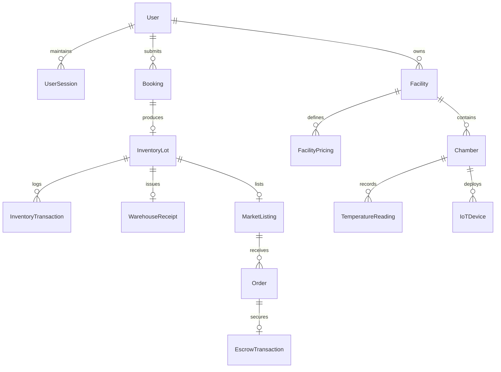
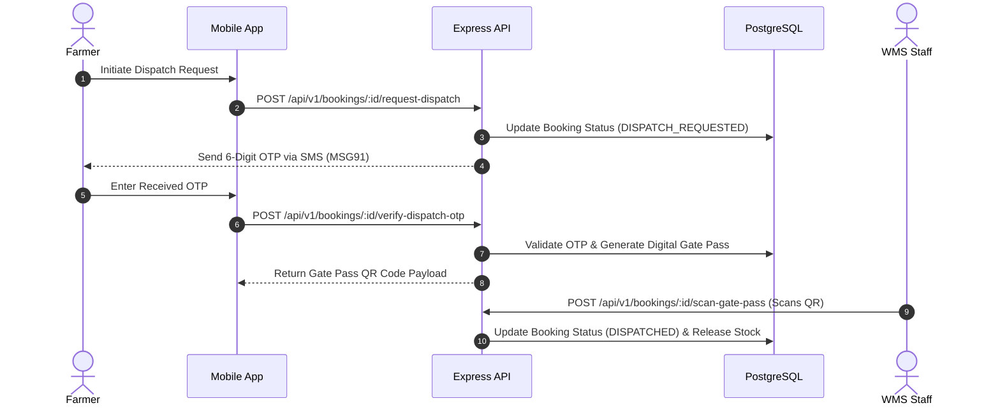
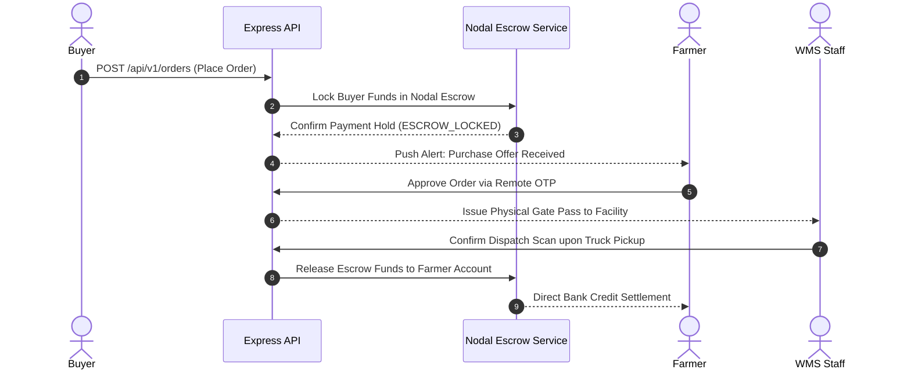

# CHAPTER 5: SYSTEM DESIGN & ARCHITECTURE

---

## 5.1 Overall System Architecture

The **ColdStorage Ecosystem** is engineered as a decoupled, multi-application agritech platform. The architecture segregates client presentation layers, micro-service API endpoints, state caching, relational persistence, and future hardware/AI integration interfaces.

```
┌─────────────────────────────────────────────────────────────────────────┐
│                           CLIENT INTERFACES                             │
├─────────────────────────┬───────────────────────┬───────────────────────┤
│   Next.js 16 Web App    │  Expo 56 Mobile App   │  WhatsApp Business    │
│  - Admin Governance     │  - Farmer Pocket      │  - WhatsApp Flows     │
│  - Owner/Staff WMS      │  - Buyer Marketplace  │  - Interactive Cards  │
│  - Public Landing       │  - Owner Terminal     │  - Automated Alerts   │
└───────────┬─────────────┴───────────┬───────────┴───────────┬───────────┘
            │ HTTP (Cookies)          │ HTTP (Bearer JWT)     │ Webhooks
            └─────────────────────────┼───────────────────────┘
                                      ▼
┌─────────────────────────────────────────────────────────────────────────┐
│                         EXPRESS 5 REST API LAYER                        │
│   Node.js 22 | Express 5 | Prisma 7 ORM | Zod Request Validation        │
│   - Auth & Session Service  - WMS & Inventory Engine - Escrow Service   │
│   - Booking Lifecycle       - Marketplace & Bidding  - Alert Engine     │
└───────────┬─────────────────────────┬───────────────────────┬───────────┘
            │                         │                       │
            ▼                         ▼                       ▼
┌────────────────────────┐  ┌──────────────────┐    ┌────────────────────┐
│  PostgreSQL 16 DB      │  │  Redis 7 Cache   │    │ Simulated / Future │
│  - Users & Bookings    │  │  - Rate Limiting │    │ IoT Telemetry Node │
│  - Lots & Transactions │  │  - Token Storage │    │ (ESP32 MQTT Spec)  │
│  - Escrow & Audit      │  │  - Idempotency   │    │                    │
└────────────────────────┘  └──────────────────┘    └────────────────────┘
```

### Key Architectural Layers:

1. **Client Presentation Layer:** Comprises three specialized frontends:
   - **Next.js 16 Web Dashboard:** Server-side rendered web app providing high-density data visualizations for Administrators and Cold Storage Owners/Staff.
   - **Expo 56 Mobile App:** Cross-platform React Native application supporting Farmers, Buyers, and Warehouse Staff with offline queueing capabilities.
   - **WhatsApp Business Interface:** Interactive WhatsApp Flows for low-literacy rural users.
2. **API Gateway & Business Logic Layer:** Centralized **Node.js 22 / Express 5** REST API managing business rules, RBAC authorization, workflow lifecycles, and audit logging.
3. **Caching & Security Tier:** **Redis 7** handling sliding-window rate limiting, JWT token blacklisting, and request idempotency validation.
4. **Relational Database Tier:** **PostgreSQL 16** managed via **Prisma 7 ORM**, guaranteeing ACID compliance for all transactional, inventory, and escrow operations.
5. **Architectural Extension Blueprint (IoT & Voice AI):** Specifications for connecting **ESP32** microcontrollers over **EMQX MQTT** and **Bhashini/Sarvam AI** WebSockets in post-internship deployment.

---

## 5.2 Database Design

The relational database (`backend/prisma/schema.prisma`) comprises **23 distinct Prisma models** and **18 domain Enums**.



### Detailed Schema Entities Summary

| Model Group | Models Included | Primary Responsibilities |
|---|---|---|
| **Identity & KYC** | `User`, `UserSession`, `UserDocument`, `PhoneOTP` | User roles (`SUPER_ADMIN`, `ADMIN`, `OWNER`, `STAFF`, `FARMER`, `BUYER`), JWT sessions, Aadhaar/PAN/GSTIN KYC docs, and OTP verification records. |
| **Facilities & Chambers**| `Facility`, `Chamber`, `FacilityPricing`, `FacilityDocument` | Cold storage facility metadata, chamber capacity (MT), storage type (`BAG`/`BULK`), operational status, and compliance licenses. |
| **Bookings & Inventory** | `Booking`, `InventoryLot`, `InventoryTransaction` | Full lifecycle of storage bookings, digitized lot parameters (KG, bag count, moisture, grade `A`/`B`/`C`), and immutable transaction logs. |
| **Billing & Finance** | `Invoice`, `InvoiceLineItem`, `Payment`, `EscrowTransaction` | Storage charges calculation, itemized invoices, payment methods, and nodal account escrow holds. |
| **Marketplace & Trade** | `MarketListing`, `Order`, `FacilityReview`, `WarehouseReceipt` | Pan-India commodity listings, buyer orders, facility ratings, and WDRA eNWR receipts. |
| **Telemetry & Alerts** | `TemperatureReading`, `IoTDevice`, `Notification`, `AuditLog` | Microclimate readings, device heartbeats, in-app/push alerts, and global audit logs. |

---

## 5.3 Backend Architecture

The backend (`backend/src/`) follows a layered micro-services controller-service pattern.

```
backend/src/
├── config/             # DB, Redis, Env validation, Winston Logger
├── modules/            # Feature Domain Modules
│   ├── auth/           # Login, Register, Refresh, OTP, RBAC
│   ├── bookings/       # Booking Lifecycle Engine
│   ├── facilities/     # Facility & Chamber CRUD
│   ├── inventory/      # Intake, Release, Barcode Generation
│   ├── marketplace/    # Commodity Listings & Bidding
│   ├── orders/         # Order Management & Dispatch OTP
│   ├── escrow/         # Escrow Payment Hold & Payout Release
│   ├── temperature/    # Microclimate & Anomaly Check Handler
│   └── notifications/  # Push Notifications & SMS Alert Engine
└── shared/             # Reusable Middleware & Utilities
    ├── middleware/     # Auth, Validate, Idempotency, Upload guards
    └── utils/          # PDF Generator, Reg Number Generator, Audit Log
```

### Request Execution & Security Pipeline
Every incoming HTTP request passes through a multi-stage security pipeline:
1. **Security & Parser Layer:** `helmet()`, `cors()`, `express.json()`, and `cookieParser()`.
2. **Rate Limiting Guard (`rate-limiter.ts`):** Enforces dynamic sliding-window rate limits in Redis based on client IP or authenticated user ID.
3. **Authentication Guard (`auth.middleware.ts`):** Validates Bearer JWT Access Tokens, checking token expiration and Redis blacklist status.
4. **Idempotency Guard (`idempotency.ts`):** Intercepts POST/PUT requests carrying `X-Idempotency-Key`, returning cached responses for replayed requests.
5. **Schema Validation (`validate.ts`):** Validates request parameters against strict **Zod** schemas before invoking business controllers.

---

## 5.4 Web Application Architecture

The web frontend (`frontend/src/`) is built on **Next.js 16 (App Router)** and **React 19**, incorporating a dual-layout sidebar system for Administrators and WMS Facility Owners.

```
┌─────────────────────────────────────────────────────────────────────────┐
│                      NEXT.JS WEB FRONTEND LAYOUT                        │
├─────────────────────────────────────────────────────────────────────────┤
│                                                                         │
│                      [Root App Layout (layout.tsx)]                     │
│                                   │                                     │
│         ┌─────────────────────────┴─────────────────────────┐           │
│         ▼                                                   ▼           │
│ [Admin Dashboard Layout]                           [WMS Dashboard Layout]
│  - Overview & Analytics                             - Volumetric Chambers
│  - Facility Onboarding                             - Weighbridge Intake 
│  - KYC Compliance Review                           - Inventory Lots     
│  - Anti-Gouging Oversight                          - PDF Invoicing      
│                                                                         │
└─────────────────────────────────────────────────────────────────────────┘
```

### State & API Management
- **Zustand State Stores (`stores/`):** Lightweight client state management governing authenticated user profiles (`auth-store.ts`) and active facility selections (`facility-store.ts`).
- **Unified API Client (`lib/api-client.ts`):** Axios-based HTTP wrapper featuring automatic `401 Unauthorized` interception and transparent token refresh retries.

---

## 5.5 Mobile Application Architecture

The mobile app (`mobile/src/`) is built using **Expo 56** and **Expo Router**, supporting cross-platform execution on iOS and Android.

```
mobile/
├── app/
│   ├── (auth)/         # Phone OTP & Password Login
│   ├── (tabs)/         # Farmer Experience (Home, Inventory, Marketplace)
│   ├── (buyer)/        # Buyer Experience (Listings, Bidding, Escrow)
│   └── (owner)/        # Owner Terminal (QR Scanner, Operations)
├── components/         # Reusable Native UI Components
├── contexts/           # AuthContext, OfflineSyncContext
└── lib/                # API Client, Offline Queue, i18n
```

### Offline Queueing Engine (`mobile/lib/offline-queue.ts`)
To accommodate poor network coverage in rural areas, the mobile client implements an offline mutation queue:

```
[User Executes Action Offline] ──► [Serialize Mutation & Generate Idempotency Key]
                                                   │
                                                   ▼
[Network Restored] ◄── [Store in Persistent Device Storage (AsyncStorage)]
        │
        ▼
[Flush Queue sequentially to API with X-Idempotency-Key Header]
```

---

## 5.6 API Workflow Execution Flows

### 5.6.1 Remote OTP Stock Release Flow (Eradicating "Travel Tax")



### 5.6.2 Direct Marketplace Escrow Settlement Flow


