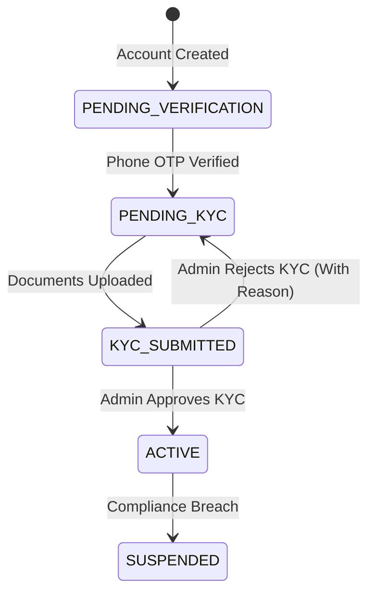
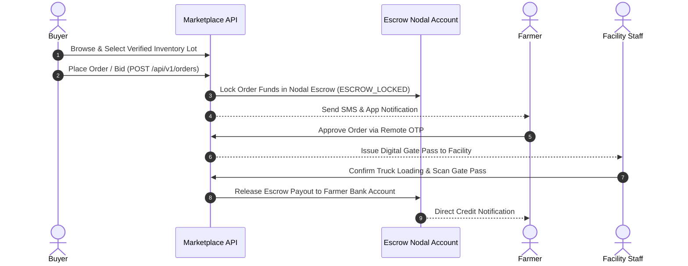

# CHAPTER 6: MODULES DEVELOPED

---

## 6.1 Authentication Module

The **Authentication Module** (`backend/src/modules/auth/`) provides secure, multi-role identity management, token issuing, session tracking, and role-based access control across all client applications.

```
┌─────────────────────────────────────────────────────────────────────────┐
│                     AUTHENTICATION ARCHITECTURE                         │
├─────────────────────────────────────────────────────────────────────────┤
│                                                                         │
│  [Password Login (Admin/Owner)] ──┐                                     │
│                                   ├─► [Express Auth Controller]         │
│  [Phone OTP Login (Farmer/Buyer)] ┘            │                        │
│                                                ▼                        │
│                                 [Generate JWT Token Pair]               │
│                                                │                        │
│          ┌─────────────────────────────────────┴──────────────────┐     │
│          ▼                                                        ▼     │
│  [Access Token (15 min)]                                [Refresh Token] │
│  - Sent in Auth Header                                  - Stored in DB  │
│  - Validated by middleware                              - UserSession   │
│                                                                         │
└─────────────────────────────────────────────────────────────────────────┘
```

### Key Technical Capabilities:

1. **Multi-Role Support (6 Roles):** Supports `SUPER_ADMIN`, `ADMIN`, `OWNER`, `STAFF`, `FARMER`, and `BUYER`.
2. **Dual Authentication Pathways:**
   - **Credential Authentication:** Email/phone and bcrypt-hashed password verification.
   - **Passwordless Phone OTP Authentication:** Integrated with the **MSG91** SMS gateway. Generates a 6-digit OTP stored in the `PhoneOTP` model (hashed with bcrypt, expiring in 5 minutes).
3. **Dual-Token Lifecycle:**
   - **Access Token:** Short-lived JWT (15 minutes) carrying `userId`, `role`, `facilityId`, and `status`.
   - **Refresh Token:** Long-lived JWT (7 days) persisted in the `UserSession` database model.
4. **Session Management & Token Revocation:** `POST /api/v1/auth/logout` revokes sessions from PostgreSQL and blacklists active tokens in Redis.
5. **RBAC Guard (`auth.middleware.ts`):** Express middleware `authenticate` and `requireRole(roles...)` protecting downstream endpoints.

---

## 6.2 User Management Module

The **User Management Module** (`backend/src/modules/users/` and `kyc/`) governs profile management, local farmer registration, and identity KYC document verification.



### Key Technical Capabilities:

1. **User Profile & Depositor Management:** Enables facility staff to create local depositor profiles for farmers who lack smartphones, recording full name, phone number, address, village, and Khasra land record numbers.
2. **KYC Document Upload Engine (`UserDocument`):** Supports uploading Aadhaar (front/back), PAN cards, GSTIN certificates, FSSAI licenses, and business registrations.
3. **Admin Verification Workflow:** Admins review submitted documents via `GET /api/v1/kyc/pending`, inspecting file uploads before setting status to `APPROVED` or `REJECTED` (with mandatory rejection reasons).

---

## 6.3 Cold Storage Management Module

The **Cold Storage Management Module** (`backend/src/modules/facilities/`, `chambers/`, `pricing/`) models physical infrastructure, volumetric capacities, and rental rate structures.

```
┌─────────────────────────────────────────────────────────────────────────┐
│                    COLD STORAGE MANAGEMENT MODEL                        │
├─────────────────────────────────────────────────────────────────────────┤
│                                                                         │
│  [Facility Model] ──► Capacity (MT), Storage Type (BAG/BULK/HYBRID)      │
│         │                                                               │
│         ├──► [Chambers] ──► Temperature Range (-25°C to +15°C), Humidity │
│         │                                                               │
│         ├──► [Pricing]  ──► PER_DAY_PER_MT, PER_MONTH_PER_MT, PER_SEASON│
│         │                                                               │
│         └──► [Documents]──► FSSAI, WDRA, Fire Safety, Pollution Licenses │
│                                                                         │
└─────────────────────────────────────────────────────────────────────────┘
```

### Key Technical Capabilities:

1. **Facility Onboarding & Geo-Spatial Mapping:** Tracks facility name, unique registration numbers, address, city, state, pincode, GPS coordinates (latitude/longitude), and status (`PENDING_REVIEW`, `ACTIVE`).
2. **Chamber Microclimate Configuration:** Defines internal chambers, volumetric capacity (in Metric Tonnes), temperature operational boundaries (-25°C to +15°C), humidity controls, and operational status (`OPERATIONAL`, `MAINTENANCE`, `OFFLINE`).
3. **Dynamic Pricing Models (`FacilityPricing`):** Configures rental structures (`PER_DAY_PER_MT`, `PER_MONTH_PER_MT`, `PER_SEASON`, `FLAT_RATE`).
4. **Anti-Gouging Administrative Oversight:** Automatically flags facilities attempting monopolistic rental rate spikes during peak harvest seasons.
5. **Temperature Log Handler (`temperature` module):** Features API endpoints (`POST /api/v1/temperature/ingest` and `GET /api/v1/temperature/chamber/:id`) storing and querying chamber microclimate data (with backend test data generators acting as simulated sensor nodes).

---

## 6.4 Inventory & Lot Management Module

The **Inventory & Lot Management Module** (`backend/src/modules/inventory/`) acts as the digital twin of physical stored commodities.

```
┌─────────────────────────────────────────────────────────────────────────┐
│                        DIGITIZED INTAKE WORKFLOW                        │
├─────────────────────────────────────────────────────────────────────────┤
│  [Farmer Arrival] ──► [Weighbridge Gross & Tare Weight (KG)]            │
│                                │                                        │
│                                ▼                                        │
│  [Quality Inspection] ──► Grade A / B / C & Moisture Percentage         │
│                                │                                        │
│                                ▼                                        │
│  [Create InventoryLot] ──► Unique Barcode / QR Issued ──► Chamber Stored│
│                                │                                        │
│                                ▼                                        │
│  [Audit Log Entry] ──► Immutable InventoryTransaction Recorded          │
└─────────────────────────────────────────────────────────────────────────┘
```

### Key Technical Capabilities:

1. **Digitized Weighbridge Intake:** Captures gross weight, tare weight, net weight (KG), bag count, moisture level, and quality grade (`A`, `B`, `C`, `REJECTED`).
2. **Unique Lot Barcode Generation:** Generates unique string identifiers (e.g., `LOT-202607-0042`) and printable barcode graphics for bag/pallet tagging.
3. **Immutable Inventory Transactions (`InventoryTransaction`):** Records all inventory events (`INTAKE`, `PARTIAL_RELEASE`, `FULL_RELEASE`, `QUALITY_UPDATE`, `WEIGHT_ADJUSTMENT`, `TRANSFER`) with performer and authorizer user IDs.

---

## 6.5 Billing & Invoice Management Module

The **Billing & Invoice Management Module** (`backend/src/modules/invoices/`) automates storage fee calculations, payment recording, and PDF invoice generation.

```
┌─────────────────────────────────────────────────────────────────────────┐
│                         AUTOMATED BILLING FLOW                          │
├─────────────────────────────────────────────────────────────────────────┤
│  [Lot Storage Duration (Days)] × [Weight (MT)] × [Rate (₹/Day/MT)]      │
│                                │                                        │
│                                ▼                                        │
│  [Generate Invoice] ──► Itemized Line Items + Tax Breakdown             │
│                                │                                        │
│                                ▼                                        │
│  [Render PDF Receipt] ──► Downloadable PDF via pdf-generator.ts         │
│                                │                                        │
│                                ▼                                        │
│  [Record Payment] ──► Cash, UPI, Bank Transfer, Cheque Settlement       │
└─────────────────────────────────────────────────────────────────────────┘
```

### Key Technical Capabilities:

1. **Automated Charge Calculation:** Dynamically computes accumulated storage charges based on stored weight, days in chamber, and applicable pricing tiers.
2. **PDF Invoice Generator (`pdf-generator.ts`):** Uses server-side rendering to produce professional PDF invoices formatted with facility registration numbers, line items, subtotal, GST tax, and payment status badges.
3. **Multi-Channel Payment Recording (`Payment`):** Supports recording full or partial payments via `CASH`, `UPI`, `BANK_TRANSFER`, and `CHEQUE`.

---

## 6.6 Farmer Mobile Application Module

The **Farmer Mobile Application** (`mobile/app/(tabs)/`) provides smallholder farmers with a localized, offline-capable mobile command center.

```
┌─────────────────────────────────────────────────────────────────────────┐
│                    FARMER MOBILE APPLICATION MODULE                     │
├──────────────────────────┬──────────────────────────┬───────────────────┤
│  Digital Pocket Ledger   │ Spatial Discovery Engine │  Remote OTP Release│
├──────────────────────────┼──────────────────────────┼───────────────────┤
│ • Stored MT & Bag count  │ • GPS distance sorting   │ • Bypasses 50 km  │
│ • Accumulated rent fees  │ • Price comparison       │   "Travel Tax"    │
│ • Chamber Temp status    │ • Commodity filter       │ • Digital Gate Pass│
│ • Live Mandi prices      │ • Ratings & reviews      │   QR generation   │
└──────────────────────────┴──────────────────────────┴───────────────────┘
```

### Key Technical Capabilities:

1. **Digital Pocket Ledger:** Displays total deposited tonnage, accumulated rental dues, chamber temperature health indicators, and historical transactions.
2. **Spatial Facility Discovery (`discover.tsx`):** GPS-based discovery engine filtering facilities by distance, daily rate, user ratings, and crop compatibility.
3. **Remote OTP Release Approval:** Eradicates the 50 km "Travel Tax" by allowing farmers to review release requests and enter a 6-digit OTP on their phone to issue a **Digital Gate Pass**.
4. **Mandi Price Intelligence:** Displays live market prices across 1,600+ mandis (integrating Agmarknet and e-NAM data) to advise farmers on optimal selling times.

---

## 6.7 Buyer Marketplace Module

The **Buyer Marketplace Module** (`backend/src/modules/marketplace/`, `orders/`, `escrow/`) connects institutional buyers directly with cold storage depositors.



### Key Technical Capabilities:

1. **Verified Inventory Sourcing:** Buyers filter listings by crop variety, quality grade (`A`/`B`/`C`), facility location, and storage duration.
2. **Direct Trade Execution & Bidding:** Supports fixed-price buying or price negotiation bidding.
3. **Nodal Escrow Settlement (`EscrowTransaction`):** Secures payments in nodal accounts, holding funds until physical gate pass verification and truck loading occur.

---

## 6.8 QR Code & Gate Pass Management Module

The **QR Code & Gate Pass Management Module** (`backend/src/shared/utils/id-generator.ts` and `mobile/app/(owner)/`) bridges digital authorization with physical warehouse gate dispatch.

```
┌─────────────────────────────────────────────────────────────────────────┐
│                    GATE PASS DISPATCH VERIFICATION                      │
├─────────────────────────────────────────────────────────────────────────┤
│  [Farmer OTP Verification] ──► [System Generates Encrypted QR Payload]  │
│                                              │                          │
│                                              ▼                          │
│  [Gate Pass Details] ◄── [Staff Scans QR Code at Gate with Camera]       │
│        │                                                                │
│        ▼                                                                │
│  [System Validates Driver, Vehicle, & Approved Weight Limit]            │
│        │                                                                │
│        ▼                                                                │
│  [Gate Opens ──► Lot Weight Deducted ──► Escrow Payout Released]        │
└─────────────────────────────────────────────────────────────────────────┘
```

### Key Technical Capabilities:

1. **Cryptographic QR Payload Generation:** Encodes booking ID, lot ID, authorized weight, driver license number, vehicle registration, and expiration timestamp into a signed JSON payload.
2. **Multi-Platform Camera Scanner Integration:** Embedded QR scanners in the Next.js Web WMS and Expo Mobile Owner App allow staff to scan gate passes instantly.
3. **Automated Lot Deduction & Audit Logging:** Scanning a valid gate pass marks the booking as `DISPATCHED`, deducts weight from `InventoryLot`, records an `InventoryTransaction`, and triggers escrow payout release.
