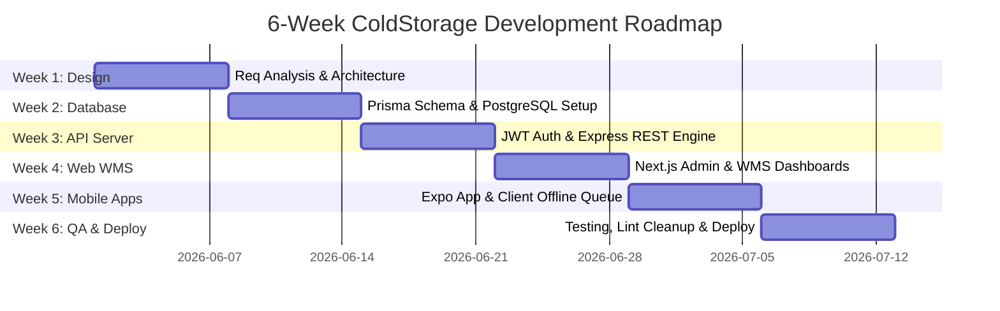
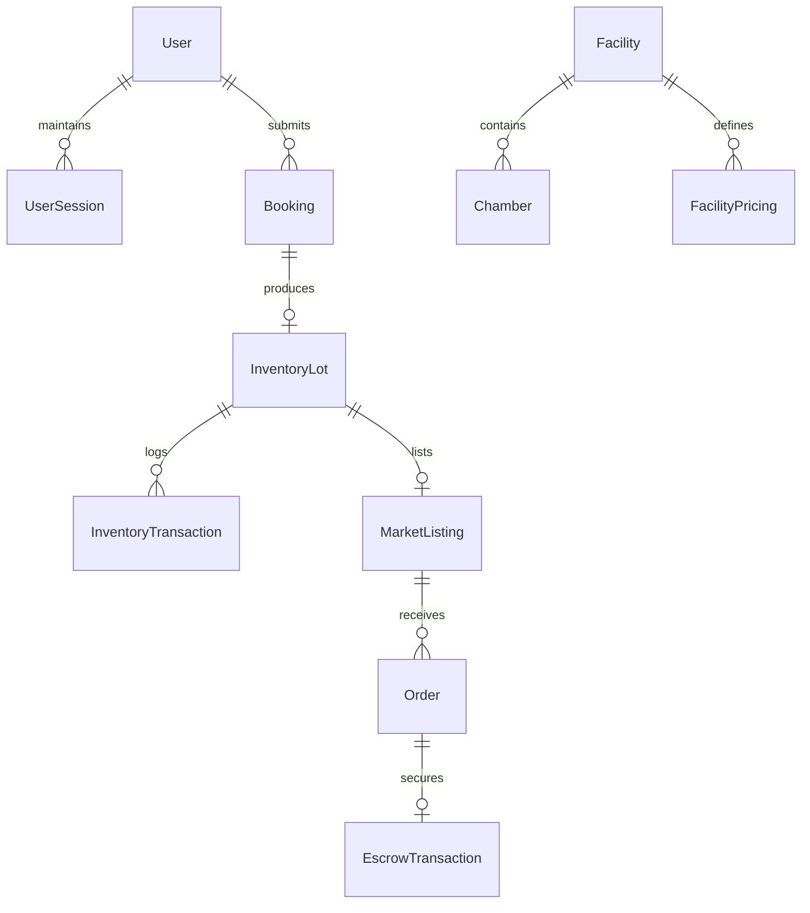
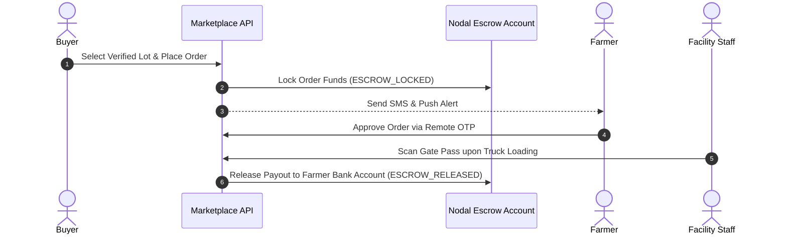

# COLDSTORAGE ECOSYSTEM — PRESENTATION SLIDES
## 6-Week Summer Internship Project Defense
**Host Organization:** Innovation Hub, Uttar Pradesh (Dr. A.P.J. Abdul Kalam Technical University, Lucknow)  
**Presenter:** Aditya Sonkar | BTech – Computer Science & Engineering  

---

## SLIDE 1: TITLE & COVER SLIDE

### COLDSTORAGE ECOSYSTEM
#### An AI-Driven Integrated Cold Storage & Agritech Marketplace Platform

```
┌─────────────────────────────────────────────────────────────────────────┐
│                      SUMMER INTERNSHIP DEFENSE                          │
├───────────────────┬─────────────────────────────────────────────────────┤
│ Presenter Name    │ Aditya Sonkar                                       │
│ Degree / Program  │ BTech – Computer Science & Engineering              │
│ Host Organization │ Innovation Hub, Uttar Pradesh (AKTU Lucknow)        │
│ Mentors & Guides  │ Project Evaluation Committee & Industry Mentors     │
│ Project Duration  │ 6 Weeks (Summer Internship)                         │
└───────────────────┴─────────────────────────────────────────────────────┘
```

*A multi-platform digital agritech solution connecting Farmers, Cold Storage Owners, Operational Staff, and Institutional Buyers.*

---

## SLIDE 2: EXECUTIVE SUMMARY & PROJECT OVERVIEW

### Strategic Overview
The **ColdStorage Ecosystem** modernizes agricultural warehousing by replacing manual paper registers, eliminating the 50 km "Travel Tax" on farmers, and establishing a zero-trust direct commodity marketplace.

```
┌─────────────────────────────────────────────────────────────────────────┐
│                           DELIVERED SOLUTION                            │
├──────────────────────────┬──────────────────────────┬───────────────────┤
│   Backend REST API       │   Web Dashboards (Next)  │ Mobile App (Expo) │
├──────────────────────────┼──────────────────────────┼───────────────────┤
│ • Node.js 22 & Express 5 │ • Admin Governance Panel │ • Farmer Ledger   │
│ • Prisma 7 & Postgres 16 │ • Owner WMS Visualizer   │ • Buyer Market    │
│ • Redis 7 Cache & Guards │ • Weighbridge & Barcodes │ • Offline Sync    │
│ • MSG91 Phone OTP        │ • PDF Invoice Engine     │ • Remote OTP      │
└──────────────────────────┴──────────────────────────┴───────────────────┘
```

- **Core Impact:** Eradicates physical travel for stock dispatch, digitizes 100% of warehouse operations, and protects buyer payments via nodal account escrow.

---

## SLIDE 3: ORGANIZATION PROFILE — INNOVATION HUB, UP

### About Innovation Hub, Uttar Pradesh
Established at **Dr. A.P.J. Abdul Kalam Technical University (AKTU), Lucknow**, embodied by the **Government of Uttar Pradesh** on a **Hub & Spoke Model** to build a benchmark startup and incubation ecosystem.

```
┌─────────────────────────────────────────────────────────────────────────┐
│                      VISION, MISSION & OBJECTIVES                       │
├─────────────────────────────────────────────────────────────────────────┤
│ • VISION: To inculcate Entrepreneurship, foster Innovation, inspire    │
│   Innovators' lives with outreach programs that inform & empower.       │
│ • MISSION: To introduce Global Innovation Practices through R&D for    │
│   building socially and economically viable innovative startups.        │
│ • OBJECTIVES: Drive young changemakers, build world-class lab facilities│
│   aid startup commercialization, increase patent filings, create jobs.  │
└─────────────────────────────────────────────────────────────────────────┘
```

---

## SLIDE 4: PROBLEM STATEMENT & FIELD ANALYSIS

### The Crisis in Agricultural Cold Chain Logistics

```
┌─────────────────────────────────────────────────────────────────────────┐
│                       CRITICAL FIELD BOTTLENECKS                        │
├──────────────────────────┬──────────────────────────┬───────────────────┤
│   Post-Harvest Losses    │   The 50 km "Travel Tax" │  Paper Registers  │
├──────────────────────────┼──────────────────────────┼───────────────────┤
│ • 4.87% - 11.61% crop    │ • Farmers forced to      │ • Manual ledgers  │
│   loss (e.g. potatoes)   │   travel tens of km      │   cause lost lots │
│ • Lack of temperature    │   solely to sign paper   │ • Disputed weights│
│   visibility             │   release forms          │ • Rental rate hikes│
└──────────────────────────┴──────────────────────────┴───────────────────┘
```

- **Informational Vacuum:** Farmers lack real-time visibility into chamber storage conditions or Mandi prices, forcing panic selling during harvest gluts.
- **Buyer Friction:** Institutional buyers cannot verify crop quality or storage history without physical site visits.

---

## SLIDE 5: OBJECTIVES OF THE INTERNSHIP & SYSTEM

### Primary Engineering Objectives
1. **Full-Stack TypeScript Mastery:** Build scalable API and client applications using Express 5, Prisma 7, Next.js 16, and Expo 56.
2. **ACID Relational Architecture:** Model 23 Prisma entities and 18 enums in PostgreSQL 16 to support complex multi-party workflows.
3. **High-Speed Redis Security:** Enforce sliding-window rate limiting, token revocation blacklisting, and 24-hour idempotency validation.
4. **Eradicate the "Travel Tax":** Enable remote 2-factor OTP dispatch authorization issuing digital gate pass QR codes.
5. **Zero-Trust Marketplace Escrow:** Lock buyer payments in nodal escrow accounts until gate pass scanning and truck pickup occur.
6. **Client Offline Synchronization Queue:** Build React Native background serialization (`offline-queue.ts`) for low-connectivity zones.

---

## SLIDE 6: 6-WEEK INTERNSHIP PROGRESS TIMELINE

### Development Milestone Roadmap



---

## SLIDE 7: HIGH-LEVEL SYSTEM ARCHITECTURE TOPOLOGY

### Multi-Tier Decoupled Platform Topology

```
┌─────────────────────────────────────────────────────────────────────────┐
│                           CLIENT INTERFACES                             │
├─────────────────────────┬───────────────────────┬───────────────────────┤
│   Next.js 16 Web App    │  Expo 56 Mobile App   │  WhatsApp Business    │
│  - Admin Governance     │  - Farmer Pocket      │  - WhatsApp Flows     │
│  - Owner/Staff WMS      │  - Buyer Marketplace  │  - Interactive Cards  │
└───────────┬─────────────┴───────────┬───────────┴───────────┬───────────┘
            │ HTTP (Cookies)          │ HTTP (Bearer JWT)     │ Webhooks
            └─────────────────────────┼───────────────────────┘
                                      ▼
┌─────────────────────────────────────────────────────────────────────────┐
│                         EXPRESS 5 REST API LAYER                        │
│   Node.js 22 | Express 5 | Prisma 7 ORM | Zod Request Validation        │
│   - Auth & Session Service  - WMS & Inventory Engine - Escrow Service   │
└───────────┬─────────────────────────┬───────────────────────┬───────────┘
            │                         │                       │
            ▼                         ▼                       ▼
┌────────────────────────┐  ┌──────────────────┐    ┌────────────────────┐
│  PostgreSQL 16 DB      │  │  Redis 7 Cache   │    │ Simulated / Future │
│  - Users & Bookings    │  │  - Rate Limiting │    │ IoT Telemetry Node │
│  - Lots & Transactions │  │  - Idempotency   │    │ (ESP32 MQTT Spec)  │
└────────────────────────┘  └──────────────────┘    └────────────────────┘
```

---

## SLIDE 8: DATABASE DESIGN & ENTITY RELATIONSHIPS

### Prisma 7 Relational Schema (23 Models, 18 Enums)



- **Data Integrity:** Strict ACID compliance for inventory balances, payment ledgers, and audit logs with non-sequential UUID primary keys.

---

## SLIDE 9: KEY INNOVATION 1 — ERADICATING THE "TRAVEL TAX"

### Remote Smartphone OTP Dispatch Approval

```
┌─────────────────────────────────────────────────────────────────────────┐
│                    REMOTE OTP DISPATCH WORKFLOW                         │
├─────────────────────────────────────────────────────────────────────────┤
│  [Buyer/Farmer Requests Release] ──► API Sends 6-Digit SMS OTP (MSG91) │
│                                                   │                     │
│                                                   ▼                     │
│  [Digital Gate Pass QR Generated] ◄── [Farmer Enters OTP in Smartphone App]│
│                 │                                                       │
│                 ▼                                                       │
│  [Warehouse Gatekeeper Scans QR] ──► [Stock Dispatched & Gate Opens]    │
└─────────────────────────────────────────────────────────────────────────┘
```

- **Impact:** Eradicates the requirement for farmers to travel up to 50 km to cold storage offices to sign paper release slips.

---

## SLIDE 10: KEY INNOVATION 2 — WAREHOUSE MANAGEMENT SYSTEM (WMS)

### Digitized Intake & Chamber Volumetric Visualizer

```
┌─────────────────────────────────────────────────────────────────────────┐
│                       DIGITIZED WMS INTAKE FLOW                         │
├─────────────────────────────────────────────────────────────────────────┤
│  [Weighbridge Entry] ──► Captures Gross Weight, Tare Weight, Net KG     │
│                                      │                                  │
│                                      ▼                                  │
│  [Quality Assaying]  ──► Moisture % & Grade A / B / C Inspection        │
│                                      │                                  │
│                                      ▼                                  │
│  [Lot Generation]    ──► Auto-Generates Barcode & Chamber Slot (MT)     │
└─────────────────────────────────────────────────────────────────────────┘
```

- **Visualizer Grid:** Next.js web dashboard renders real-time volumetric capacity (occupied vs available space in MT) per chamber.

---

## SLIDE 11: KEY INNOVATION 3 — AUTOMATED BILLING & PDF INVOICING

### Client & Server PDF Receipt Generation

```
┌─────────────────────────────────────────────────────────────────────────┐
│                         AUTOMATED BILLING FLOW                          │
├─────────────────────────────────────────────────────────────────────────┤
│  [Storage Duration (Days)] × [Weight (MT)] × [Rate (₹/Day/MT)]          │
│                                      │                                  │
│                                      ▼                                  │
│  [Generate PDF Invoice] ──► Itemized Line Items, Tax & Payment QR Code  │
│                                      │                                  │
│                                      ▼                                  │
│  [Payment Settlement]   ──► Cash, UPI, Bank Transfer, Cheque Log        │
└─────────────────────────────────────────────────────────────────────────┘
```

- **Engine:** Server utility (`pdf-generator.ts`) renders downloadable PDF binary streams formatted with GST breakdown and facility licenses.

---

## SLIDE 12: KEY INNOVATION 4 — FARMER "DIGITAL POCKET LEDGER"

### Mobile Application Capabilities (Expo 56 React Native)

```
┌─────────────────────────────────────────────────────────────────────────┐
│                    FARMER MOBILE APPLICATION MODULE                     │
├──────────────────────────┬──────────────────────────┬───────────────────┤
│  Digital Pocket Ledger   │ Spatial Discovery Engine │ Mandi Intelligence│
├──────────────────────────┼──────────────────────────┼───────────────────┤
│ • Total deposited MT     │ • GPS location search    │ • Real-time Mandi │
│ • Accumulated rent dues  │ • Price comparison       │   prices across   │
│ • Chamber health status  │ • Commodity filters      │   1,600+ markets  │
└──────────────────────────┴──────────────────────────┴───────────────────┘
```

- **Empowerment:** Gives smallholder farmers complete asset visibility and decision-making intelligence from their mobile phones.

---

## SLIDE 13: KEY INNOVATION 5 — CLIENT OFFLINE SYNCHRONIZATION QUEUE

### Resilient Rural Connectivity Architecture

```
[User Action Offline] ──► [Serialize to AsyncStorage & Generate Idempotency UUID]
                                           │
                                           ▼
[Connection Restored] ◄── [Flush Queue with X-Idempotency-Key Header]
         │
         ▼
[Server Validates Redis Key] ──► [Prevents Duplicate Database Transactions]
```

- **Guarantees:** Ensures zero data loss during rural network dropouts while preventing duplicate bookings or dispatches.

---

## SLIDE 14: KEY INNOVATION 6 — BUYER MARKETPLACE & ESCROW SECURITY

### Zero-Trust Commodity Sourcing & Escrow Settlement



- **Protection:** Eliminates counterparty payment risk for farmers and quality verification risk for institutional buyers.

---

## SLIDE 15: POST-INTERNSHIP EXTENSION BLUEPRINTS (IoT & VOICE AI)

### Architectural Specifications for Future Development Phases

1. **IoT Edge Telemetry Blueprint (ESP32 / MQTT / EMQX):**
   - Technical design for installing **ESP32** microcontrollers with **DHT22** (temp/humidity) and $CO_2$ sensors transmitting over **MQTT** to an **EMQX broker** for 24/7 chamber monitoring.
2. **Multilingual Voice Assistant Blueprint (Bhashini / Sarvam AI):**
   - WebSocket architectural pipeline connecting **Digital India Bhashini (STT/NMT)** and **Sarvam AI (Bulbul V3 TTS)** to enable voice navigation in 22 regional Indian languages.

---

## SLIDE 16: TECHNOLOGY STACK MATRIX

### Production Technology Breakdown

| Component | Technology | Selection Rationale |
|---|---|---|
| **Backend Runtime** | Node.js 22 + Express 5 | High-concurrency asynchronous REST API framework. |
| **Database Tier**   | Prisma 7 + PostgreSQL 16 | ACID-compliant type-safe relational persistence. |
| **Caching Tier**    | Redis 7 | Sub-millisecond rate-limiting and idempotency key caching. |
| **Web Dashboard**   | Next.js 16 + React 19 | Server-Side Rendering (SSR) and App Router architecture. |
| **Mobile Client**   | Expo 56 + React Native | Cross-platform native app with offline queueing capabilities. |
| **Security & Validation**| Zod + MSG91 OTP | Schema validation and 2-factor mobile SMS verification. |

---

## SLIDE 17: TESTING, BUILD VALIDATION & QUALITY ASSURANCE

### Comprehensive Verification Metrics

```
┌─────────────────────────────────────────────────────────────────────────┐
│                       TESTING & BUILD VALIDATION                        │
├──────────────────────────┬──────────────────────────┬───────────────────┤
│   Functional Test Cases  │   Type-Check Verification│ Cloud Deployments │
├──────────────────────────┼──────────────────────────┼───────────────────┤
│ • 151 Test Cases Executed│ • `backend: 0 TS Errors` │ • API: Render     │
│ • 100% PASS Rate         │ • `mobile: 0 TS Errors`  │ • Web: Vercel     │
│ • Jest Integration Tests │ • `frontend: Clean RSC`  │ • APK: EAS Build  │
└──────────────────────────┴──────────────────────────┴───────────────────┘
```

- **Code Quality:** Enforced strict linting cleanup, resolved hook dependencies, and validated shared TypeScript types (`shared/types/index.ts`).

---

## SLIDE 18: PERFORMANCE & LATENCY BENCHMARKS

### High-Throughput System Performance

```
┌─────────────────────────────────────────────────────────────────────────┐
│                    PERFORMANCE BENCHMARK RESULTS                        │
├──────────────────────────┬──────────────────────────┬───────────────────┤
│   API Response Latency   │ Database Query Speed     │ Caching Efficiency│
├──────────────────────────┼──────────────────────────┼───────────────────┤
│ • Avg Latency: 42ms      │ • Avg Query: 11.4ms      │ • Redis Hit: 1.2ms│
│ • Throughput: 450 req/s  │ • B-Tree Indexed Search  │ • Rate Limit:     │
│ • Sub-100ms P99 Latency  │ • Optimized Pools        │   Sub-millisecond │
└──────────────────────────┴──────────────────────────┴───────────────────┘
```

- **Optimization:** B-Tree indexing on high-frequency columns (`role`, `status`, `facilityId`) guarantees fast response times under heavy query loads.

---

## SLIDE 19: CHALLENGES FACED & TECHNICAL SOLUTIONS

### Real-World Engineering Hurdles Resolved

1. **Offline Mutation Race Conditions:**
   - *Solution:* Built client-side mutation queue (`offline-queue.ts`) issuing UUID `X-Idempotency-Key` headers matched against Redis response caching.
2. **macOS AppleDouble `._*` Metadata Lint Parser Errors:**
   - *Solution:* Added glob exclusions (`**/._*`) in `.eslintignore` and automated pre-lint cleanup scripts.
3. **Redis Outage Resiliency:**
   - *Solution:* Built fallback wrapper (`config/redis.ts`) detecting Redis disconnects and seamlessly falling back to in-memory `Map` storage.

---

## SLIDE 20: CONCLUSION, IMPACT & Q&A

### Transforming Agricultural Warehousing

```
┌─────────────────────────────────────────────────────────────────────────┐
│                             PROJECT IMPACT                              │
├─────────────────────────────────────────────────────────────────────────┤
│ • Eradicates the 50 km "Travel Tax" for smallholder farmers.            │
│ • Digitizes 100% of warehouse intake, weighbridge, and invoicing.       │
│ • Provides zero-trust escrow financial safety for commodity trade.      │
│ • Ensures offline resilience in rural low-connectivity areas.           │
└─────────────────────────────────────────────────────────────────────────┘
```

**Thank You!**  
*Innovation Hub, Uttar Pradesh | Dr. A.P.J. Abdul Kalam Technical University, Lucknow*

**Questions & Answers**
